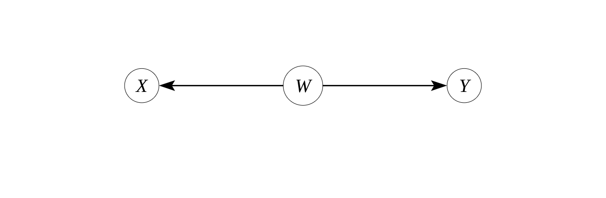

```{r setup, include=FALSE}
```


## Introdução a DAGs

DAGs ou Directed Acyclic Graphs, também conhecidos como Diagramas Causais, são uma abordagem de inferência causal que surgiu no começo do séc. XX, mas que se desenvolveu e se tornou um programa de pesquisa fecundo após o trabalho de Judea Pearl e colegas. Um DAG, como o nome diz, é um gráfico direcionado e acíclico. Isso significa que não há causalidade reversa ou causalidade simultânea.


## Um exemplo de DAG

Aqui temos um DAG com 5 variáveis, A, B, C, X e Y.


{width=50%}


## Notação de DAGs

- Causalidade: dizemos que x causa y se o valor de y depende do valor de x.
- Nó: variável
- Flecha/aresta: relação causal
- Ancentrais: precendem uma variável (C, X, B são ancenstrais de Y)
- Descendentes: decorrem de uma variável (Y e B são descendentes de X)
- Caminho (path): variáveis conectadas por arestas (flechas), diretamente ou indiretamente (por outras variáveis)

## Tipos de DAGs

- Collider (colisor, ou garfos invertidos): $X_{0}$ >- $Y_{1}$; W -> $Y_{1}$ 
- Garfos (forks): $V_{3}$ -> $V_{2}$; $V_{3}$ -> $V{2}$
- Cadeias (chains): Z -> $X_{1}$ -> _$Y_{2}$

{width=50%}

## Correlação e causalidade

-- "Correlação não implica causalidade"

-- Associação estatística (como correlação) na população (amostra infinita) decorre de três relações estruturais

-- 1. Relação de causa e efeito (chains)

-- 2. Existência de causas comuns (forks)

-- 3. Ajustar (controlar, condicionar) para efeitos compartilhados (collider ou selection bias)

-- Em amostras finitas, pode ocorrer por acaso/aleatoriedade

## O que um DAG significa?

- Todas as flechas especificam qual a relação de causalidade entre as variáveis
- Ausência de flecha significa que não há relação causal entre variáveis
- O DAG estabelece relações na população, isto é, não diz respeito a questões estatísticas de amostras finitas
- O DAG deve representar o modelo causal do pesquisador ou de uma teoria
- Causalidade como intervenção: se eu mudar o valor de x independentemente do que causa x, o que acontece com y?
- Causalidade representada por P(Y|Do(X = x1)) - P(Y|Do(X = x0)), isto é, qual a probabilidade de y se eu mudar x de x0 para x1?


## Causalidade como intervenção
Considere o DAG abaixo:

{width=50%}

Z causa $X_{1}$ e $X_{1}$ causa $Y_{2}$. Digamos que eu esteja interessado em saber o efeito causal se X = 2. 

Então, faço uma invervenção "cirúrgica", em que removo as causas de X, e faço X valer exatamente 2, e aí observo como Y muda. Esse é o efeito causal de X = 2 no DAG. Graficamente, representamos a cirurgia com a remoção de todos os ancestrais de X.


{width=50%}

## Variáveis em um DAG

:::::::::::::: {.columns}
::: {.column}
-- preditor/VI/ exposure/tratamento: X, a variável de interesse que deve ser a causa do efeito.

-- resposta/VD: Y, a variável que é o efeito ou o resultado do tratamento/preditor.

-- confounder: um ancenstral tanto do tratamento (X) quanto da resposta (Y). A é um confounder.

-- collider: descendente de duas variáveis. X é um collider para A e C.

:::
::: {.column}
```{r, echo=FALSE, out.width="100%", fig.align="right"}

```
:::
::::::::::::::


## Variáveis em um DAG - continuação

:::::::::::::: {.columns}
::: {.column}
-- mediator/mediador: descedente do tratamento (X) e ancenstral de Y. Está no caminho entre X e Y. B é um mediador.

-- instrumento: conectado (em geral um ancestral) ao tratamento (X). Não pode ter nenhum caminho (path) que vá para a resposta Y que não passe por X. C é um instrumento.
:::
::: {.column}
```{r, echo=FALSE, out.width="100%", fig.align="right"}

```
:::
::::::::::::::


## D-separação

O processo de determinar, dado um DAG e um conjunto de variáveis condicionantes ("controles"), se um par de variáveis é estatisticamente independente ou dependente.

A Ideia é associar dependência com conexão, isto é, se existe um caminho (não bloqueado) entre duas variáveis, e associar d-separação com ausência de conexão ou caminho (livre).

## D-separação - Regra 1 - Separação não-condicional

X e Y estão d-conectados se existe um caminho (não-bloqueado) entre eles.

Um caminho é qualquer sequência consecutiva de arestas (independentemente da direção).

Um caminho não-bloqueado é um caminho que pode ser traçado sem passar por um colisor (collider). Em outras palavras, flechas que apontam para um collider não constituem um caminho que passe informação.


## D-separação - Regra 1 - Separação não-condicional (continuação)

:::::::::::::: {.columns}
::: {.column}
- No DAG 1 ao lado, X e Y são d-conectados, pois eles se conectam por um caminho não bloqueado.

- No DAG 2 ao lado, X e Y não estão d-conectados, pois a única a conexão é por um caminho bloqueado por W, um collider. 

- No DAG 3 ao lado, X e Y estão d-conectados.
:::
::: {.column}
DAG 1
```{r, echo=FALSE, out.width="100%", fig.align="right"}

```

DAG 2
```{r, echo=FALSE, out.width="100%", fig.align="right"}

```


DAG 3
```{r, echo=FALSE, out.width="100%", fig.align="right"}

```

:::
::::::::::::::


## D-separação - Regra 2 - Bloqueio por condicionamento ("controle")

Se medirmos um conjunto de variáveis Z, e tomarmos seus valores como dados, isso pode mudar a relação estatística entre as demais variáveis do DAG. 


Regra 2: se x e y estão d-conectados, condicional a um conjunto de variáveis Z, se há um caminho livre de colliders entre X a Y sem passar por nenhuma variável de Z.

Se um caminho desses não existe, dizemos que X e Y são d-separados por Z, ou que cada caminho entre X e Y é bloqueado por Z.
Exemplo: Z = {R,V}

```{r, echo=FALSE, out.width="100%", fig.align="right"}

```

Exercício: Precisamos mesmo condicionar em R e V para bloquear o caminho entre X e Y? Se Não, qual o conjunto mínimo de variáveis necessárias para bloquear o caminho?


## 3. Condicionar em um collider

Medir um efeito comum de duas causas independentes cria uma associação entre elas. É o paradoxo de Berkson.
Exemplo: Você vai no DCE e pergunta quantas pessoas são canhotas. E vai no encontro anual de canhotos e perguntas quantos são de esquerda.
Junta as duas amostrar e procura ver se há correlação entre ser canhoto e ser de esquerda. E deve encontrar uma correlação negativa entre as variáveis.

Regra 3: Se um collider ou seu descendente é membro de Z, ele desbloqueia o caminho.

```{r, echo=FALSE, out.width="80%", fig.align="right"}

```


## 3. Condicionar em um collider
Vamos fazer uma simulação?

```{r, echo=T, message=FALSE, out.width="80%", fig.align="right"}
library(ggplot2)
library(tidyverse)

set.seed(2) # tornando o exemplo reproduzível
x <- rnorm(1000)
w <- rnorm(1000)
y <- 2*x + 2*w + rnorm(1000)
summary(y)

# condicionando em y > 0
df <- data.frame(x = x, w=w, y = y) %>%
  filter(y > 0)

cor.test(x, w, method=c("pearson", "kendall", "spearman"))
cor.test(df$x, df$w, method=c("pearson", "kendall", "spearman"))

# condicionar em descedente de collider também causa problema, ainda que mais atenuado
g <- .5*y + rnorm(1000)

df1 <- data.frame(x = x, w=w, y = y, g = g) %>%
  filter(g > 0)

cor.test(df1$x, df1$w, method=c("pearson", "kendall", "spearman"))
```
Notem que a correlação estimada é menor, isto é, um pouco mais próxima de zero. O tamanho do viés depende da relação entre variáveis.


## Backdoor criterion

Dadas duas variáveis (X e Y) em um DAG, um conjunto de variáveis Z satisfaz o critério de backdoor em relação a X e Y se nenhuma variável em Z é descedente de X, e Z bloqueia todos caminhos entre X e Y que contém uma flecha em direção a Y (bloqueia as portas dos fundos abertas).

Ou seja, se eu "controlar" (condicionar) para variáveis Z1, Z2, .. Zn na minha regressão, vou conseguir estimar o efeito causal de X sobre Y, desde que X não cause Z1, Z2, ..., Zn, e se os controles bloqueiam os caminhos de variáveis de confusão.


## Identificação causal

-- O que significa identificação causal ou um modelo ser identificado?

-- Com uma amostra infinita (sem incerteza amostral), é possível estimar o parâmetro (efeito causal) de uma variável

-- Podemos falar também em identificação parcial

-- Quando é possível impor limites (intervalo), mas não estimativa pontual.

-- Estratégia de identificação é como a teoria e o desenho de pesquisa produzem suposições plausíveis de que o modelo é identificado

## estratégias de identificação

Vocês vão ver no curso várias estratégias de identificação. Vou passar rapidamente por duas delas, utilizando DAGS

## Controlar para uma variável

Essa é a técnica de regressão usual.

No DAG abaixo, se quero estimar o efeito causal de X sobre Y, devo controlar para A. Assim, todos os backdoors ficam bloqueados. 

```{r, echo=FALSE, out.width="100%", fig.align="right"}

```

Podemos aplicar a definição para verificar. 

1. Nem X nem Y causam A (A não é descendente nem de X nem de Y)
2. Nenhum caminho conectando X a Y que não seja direto de X para Y está aberto (caminhos com flecha apontando para X).

## Variáveis Instrumentais

Exemplo: AJR The Colonial Origins of Comparative Development: An Empirical Investigation

Instituiçoes inclusivas que causam desenvolvimento?

## Próximos passos

-- Desenhe o DAG em cada pesquisa causal que você se envolver

-- Desenhe o DAG de cada paper causal que você ler

-- Desenhe o DAG de cada paper causal que você vir em um seminário

-- Pergunte-se: Há algum backdoor aberto?

-- Há algum collider que estão controlando e não deviam?

-- Em geral, o backdoor vem de variável defasada no tempo. Inclua uma no DAG.

## Obrigado

Contato:
mgaldino@transparencia.org.br


Twitter: @mgaldino

